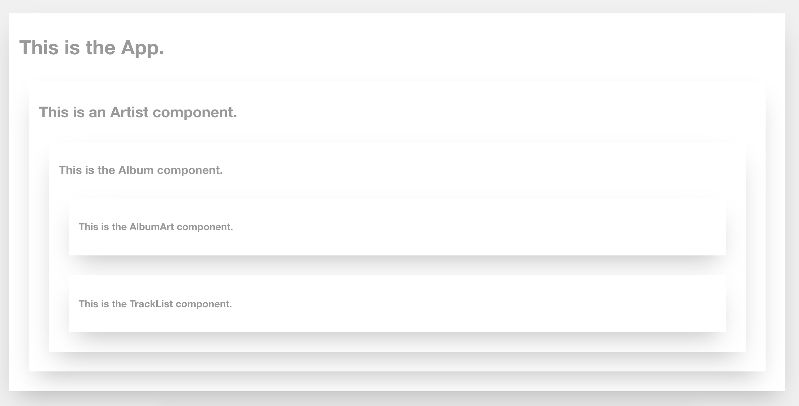

# React Parent-Child Lecture: Nesting (Music App)

This is a simple React app that shows how components are nested. It corresponds to the [parent-child nesting lecture](https://github.com/upperlinecode/CS-and-the-City-Curriculum/blob/master/react/parent-child.md) which is part of the [CS And The City](https://github.com/upperlinecode/CS-and-the-City-Curriculum) curriculum built by Upperline Code.

## Getting Started

1. Clone this repository using `git clone`
2. `cd` into the folder you just cloned
3. `npm install`
4. `npm start`
